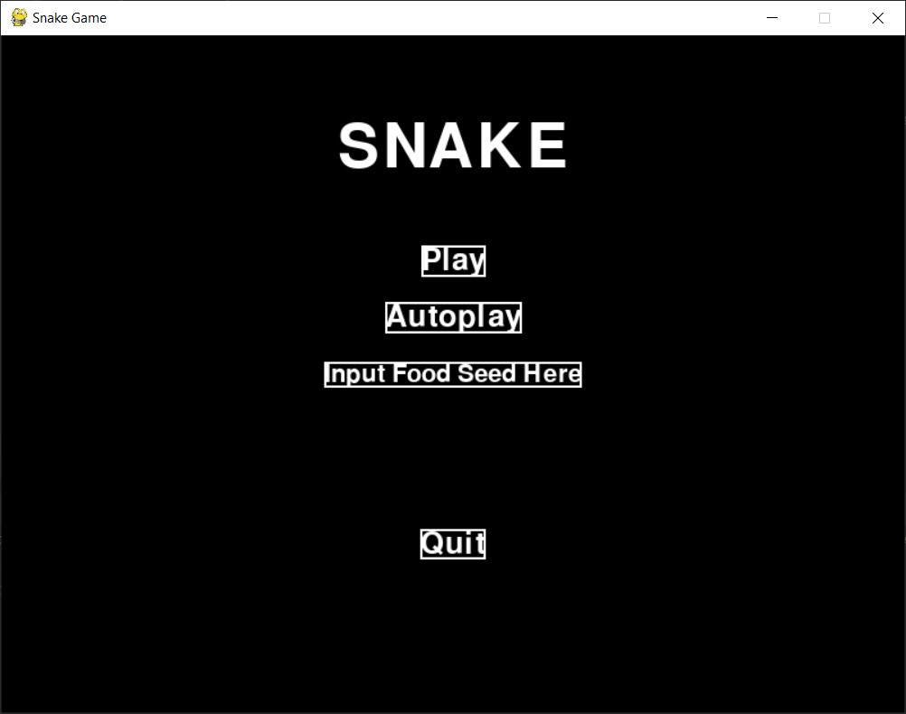
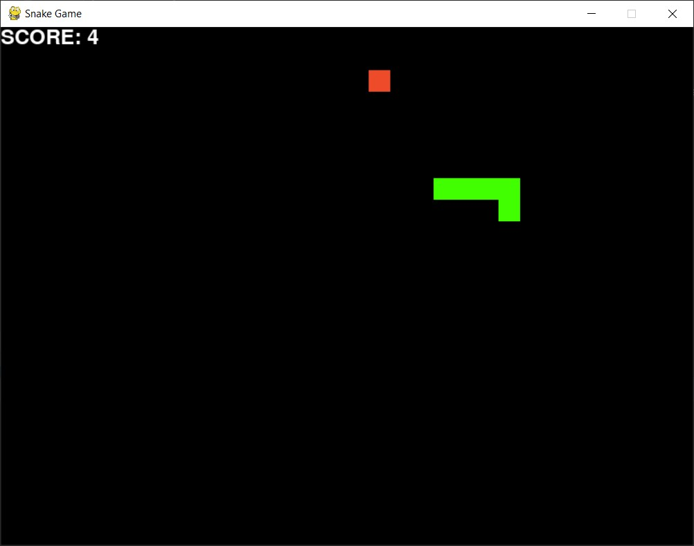

# Snake Bot using A* Search Algorithm 
> A simple snake game with autoplay features using A* algorithm.
> This project is made to fulfill an assignment from IF2211 - Algorithm Strategies - 2022/2023 lecture.

## Table of Contents
* [Overview](#overview)
* [Technologies Used](#technologies-used)
* [Features](#features)
* [Setup](#setup)
* [Usage](#usage)
* [Screenshots](#screenshots)
* [Project Status](#project-status)
* [Room for Improvement](#room-for-improvement)
* [Acknowledgements](#acknowledgements)
* [Author](#author)


## Overview
- This project is a simple implementation of Snake game using Python (Pygame).
- This project includes implementation of Snake game bot using A* algorithm.


## Technologies Used
- Python 3
- Pygame


## Features
- Snake Game
- Two modes of control: player control and autoplay
- Snake food generation seed


## Setup
Install [Python 3](https://www.python.org/downloads/) and Pygame. To install Pygame, use the following command.
```shell
pip install pygame
```


## Usage
1. Start the game by running this command in the root of repository.
    ```shell
    python src/snakegame.py
    ```
2. Click on `Play` to play and control the snake. Click on `Autoplay` to start the snake bot.
3. Optionally, set food generation seed before clicking `Play` or `Autoplay`. To set seed, click on the box and type a string, then proceed to start the game.
4. To control the snake, use arrow keys (not available on `Autoplay`).
5. To pause or resume the game, press space bar key.
6. To exit, press escape key.


## Screenshots




## Project Status
Project is: _complete_


## Room for Improvement
Room for improvement:
- GUI styling
- Custom levels
- Variable speed


## Acknowledgements
- This project's base game implementation was based on [this tutorial](https://www.edureka.co/blog/snake-game-with-pygame/).
- Many thanks to IF2211 - Algorithm Strategies - 2022/2023 lecturers.


## Author
| Name                   | GitHub                                            | NIM      |
|------------------------|---------------------------------------------------|----------|
| Eugene Yap Jin Quan    | [yuujin-Q](https://github.com/yuujin-Q)           | 13521074 |
